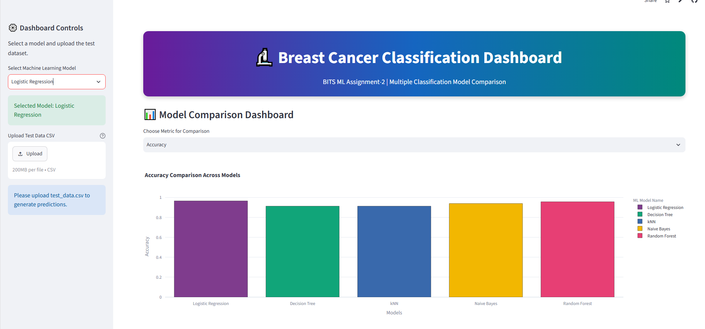
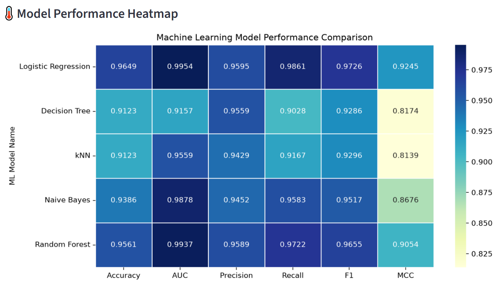
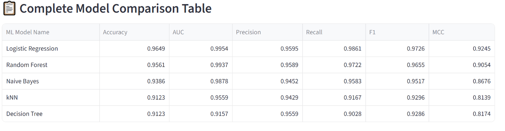
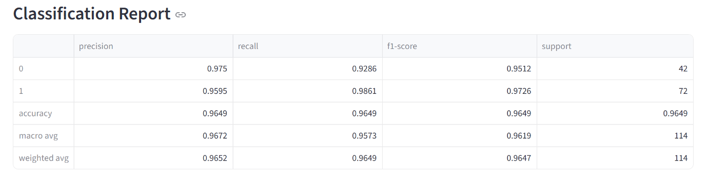
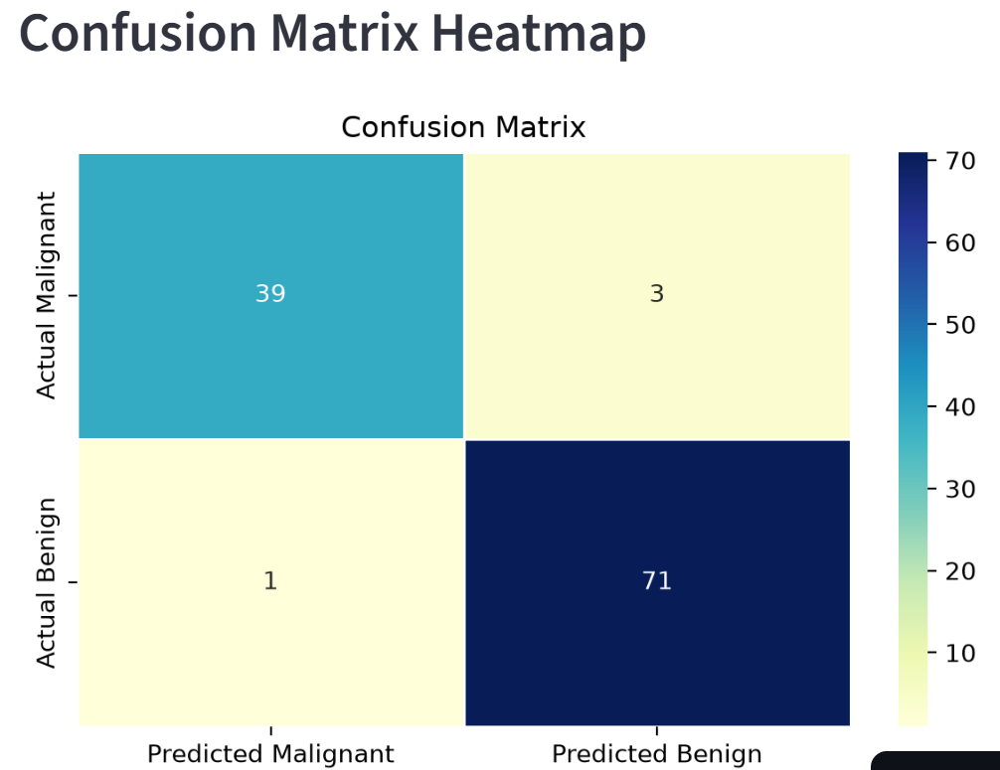
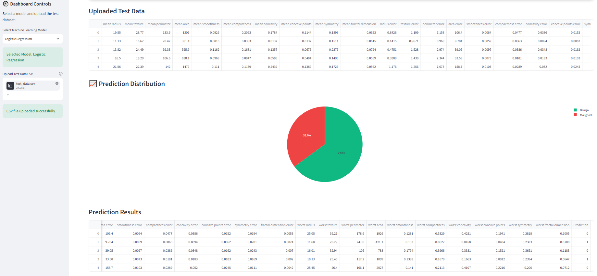

# Breast Cancer Classification Using Machine Learning

## BITS ML Assignment-2

## A. Problem Statement

The objective of this project is to develop and compare multiple machine learning classification models for predicting whether a breast tumor is malignant or benign.

The project uses the Breast Cancer Wisconsin Diagnostic Dataset. Five classification models are trained and evaluated on the same dataset:

1. Logistic Regression
2. Decision Tree Classifier
3. K-Nearest Neighbors Classifier
4. Gaussian Naive Bayes Classifier
5. Random Forest Classifier

The performance of each model is evaluated using the following metrics:

- Accuracy
- Area Under the ROC Curve (AUC)
- Precision
- Recall
- F1 Score
- Matthews Correlation Coefficient (MCC)

An interactive Streamlit web application is developed to allow users to:

- Upload test data in CSV format
- Select a machine learning model
- Generate predictions on uploaded test data
- View model evaluation metrics
- Compare the performance of all implemented models
- Review a classification report
- Visualize the confusion matrix

---

## B. Dataset Description

### Dataset Name

Breast Cancer Wisconsin Diagnostic Dataset

### Dataset Source

Scikit-Learn Built-in Dataset

### Dataset Characteristics

- Total Instances: 569
- Total Features: 30
- Target Classes: 2

### Target Variable

- 0 = Malignant Tumor
- 1 = Benign Tumor

### Feature Description

The dataset contains numerical features computed from digitized images of breast mass cell nuclei. These measurements include:

- Radius
- Texture
- Perimeter
- Area
- Smoothness
- Compactness
- Concavity
- Symmetry
- Fractal Dimension

and several related statistical measurements.

### Why This Dataset Was Selected

The Breast Cancer Wisconsin Dataset satisfies the assignment requirements because:

- It is a classification dataset.
- It contains more than 500 instances.
- It contains more than 12 features.
- It is suitable for comparing multiple classification algorithms.
- It is widely used for machine learning benchmarking and evaluation.

---
## C. GitHub Repository Link

GitHub Repository:

https://github.com/appanigrahi/bits-ml-assignment

---
## D. Models Used and Performance Comparison

### Model Comparison Table

| ML Model Name | Accuracy | AUC | Precision | Recall | F1 Score | MCC |
|---------------|----------|-----|-----------|--------|----------|-----|
| Logistic Regression | 0.9649 | 0.9954 | 0.9595 | 0.9861 | 0.9726 | 0.9245 |
| Decision Tree | 0.9123 | 0.9157 | 0.9559 | 0.9028 | 0.9286 | 0.8174 |
| kNN | 0.9123 | 0.9559 | 0.9429 | 0.9167 | 0.9296 | 0.8139 |
| Naive Bayes | 0.9386 | 0.9878 | 0.9452 | 0.9583 | 0.9517 | 0.8676 |
| Random Forest | 0.9561 | 0.9937 | 0.9589 | 0.9722 | 0.9655 | 0.9054 |

---

## E. Model Performance Observations

| ML Model Name | Observation |
|---------------|-------------|
| Logistic Regression | Logistic Regression achieved the highest overall performance on the Breast Cancer Wisconsin Dataset. It produced the highest Accuracy (96.49%), AUC (99.54%), Recall (98.61%), F1 Score (97.26%), and MCC (92.45%). |
| Decision Tree | Decision Tree provided good interpretability but produced lower performance compared to Logistic Regression and Random Forest. The model showed lower recall and MCC values, indicating reduced classification capability. |
| kNN | kNN achieved performance similar to Decision Tree. The model produced reasonable precision and recall but was outperformed by Logistic Regression, Random Forest, and Naive Bayes. |
| Naive Bayes | Naive Bayes produced strong results with high AUC (98.78%) and balanced classification performance. The model was computationally efficient and performed better than kNN and Decision Tree. |
| Random Forest | Random Forest produced the second-best overall performance with Accuracy of 95.61% and AUC of 99.37%. Ensemble learning improved robustness and classification performance. |
| Overall Winner | Logistic Regression was selected as the best-performing model because it achieved the highest Accuracy, AUC, Recall, F1 Score, and MCC values among all evaluated models. |

---

---

## F. Live Streamlit Application

Streamlit Application Link:

https://bits-ml-assignment.streamlit.app/

---
## G. Application Features

The Streamlit application provides the following features:

- Upload test dataset in CSV format
- Select machine learning model
- Generate predictions on uploaded data
- View model evaluation metrics
- Compare models using interactive charts
- View classification report
- Visualize confusion matrix heatmap
- Analyze prediction distribution

---
## H. Screenshots

### Streamlit Dashboard Home Page

### Model Performance Heatmap

### Complete Model Comparison Table

### Classification Report

### Confusion Matrix Heatmap

### Prediction Results

